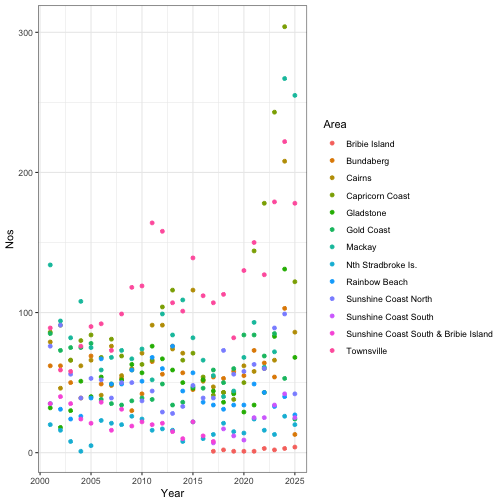

### Uploading and viewing dataset


``` r
getwd()
```

```
## [1] "/Users/alexanderbarkley/Desktop/Techniques 1 - Modules/Module 4 Workshops/Module4-workshops-git/MB5370_Mod4_Alex/code"
```

``` r
library (tidyverse)
library(janitor)


shark <- 
  read.csv("../data/QFISH Assigment shark dataset.csv") |> #evaluating from root directory
  row_to_names(row_number = 2, remove_rows_above = FALSE) |> 
  clean_names()

head(shark)
#view(shark)
as_tibble(shark)
```

### Extracting relevant species/taxa data from the larger dataframe - sharks


``` r
shark_catch <-
  shark |>
  select (area | contains ("shark")) |> # keep "area" and all columns that contain the word "shark"
  row_to_names(row_number = 1) |> # Move the first row of the dataset into the column names
  rename(Area = 1) |> # Rename the first column to "Area" for clarity
  mutate (across(-c(Area), as.numeric)) # Convert all columns except "Area" to numeric values 

shark_catch
```


### Turtles 


``` r
turtle_catch <-
  shark |>
  select (area | contains ("turtle")) |>
  row_to_names(row_number = 1) |>
  rename(Area = 1) |> 
  mutate (across(-c(Area), as.numeric))

turtle_catch
```


### Mammals


``` r
mammal_catch <-
  shark |>
  select (area | contains ("mammal")) |>
  row_to_names(row_number = 1) |>
  rename(Area = 1) |> 
  mutate (across(-c(Area), as.numeric))

mammal_catch
```


### Other 


``` r
other_catch <-
  shark |>
  select (area | contains ("other")) |>
  row_to_names(row_number = 1) |>
  rename(Area = 1) |> 
  mutate (across(-c(Area), as.numeric))

other_catch
```

### Pivoting wide tables longer 


``` r
shark_catch_long <-
  shark_catch |>
  pivot_longer(!Area, names_to = "Year", values_to = "Nos") #reshape from wide to long; keeping area column as is and all other column names (previously years) become values in a new 'Year' column. Their corresponding values go into a new "Nos" (number of sharks) column
shark_catch_long


# Plotting the data
shark_catch_long|>
  filter(Area != "Grand Total") |> #excluding Grand Total points from the plot
  ggplot (aes(x= Year, y = Nos, group = Area, colour = Area, fill = Area)) +
  geom_point() + 
  theme_bw()
```




### Attempt 1


``` r
# Summarise statistics of shark catches by year

shark_stats <- 
  shark_catch_long |>                     # Using the long-format dataset for sharks
  filter(Area != "Grand Total") |>        # Excluding total summary
  group_by(Year) |>                       # Grouping data by calendar year
  summarise(
    Mean = mean(Nos, na.rm = TRUE),       # Calculating the mean number of shark catches
    SD = sd(Nos, na.rm = TRUE)            # Calculating the standard deviation
  ) |> 
  mutate(Year = as.numeric(Year)) |>      # Ensures the year is treated as numeric
  mutate(Taxa = "Sharks")                 # Adds a new column identifying this group as "Sharks"

# View
shark_stats


# Creating a plot of mean shark catches over time with error bars

ggplot(data = shark_stats, aes(x = Year, y = Mean, fill = Taxa, shape = Taxa), colour = "black") +
  geom_line() +                           # Draw a line connecting yearly mean values
  geom_pointrange(                        # Add points with vertical error bars
    aes(ymin = Mean - SD, ymax = Mean + SD),  # Error bars = mean ± standard deviation
    size = 0.5                           
  ) +
  scale_shape_manual(values = c(23, 24))  # Set custom shapes for the points (if multiple taxa)
```


``` r
theme_bw()                                 # Apply a clean black-and-white theme 
```

```
## List of 136
##  $ line                            :List of 6
##   ..$ colour       : chr "black"
##   ..$ linewidth    : num 0.5
##   ..$ linetype     : num 1
##   ..$ lineend      : chr "butt"
##   ..$ arrow        : logi FALSE
##   ..$ inherit.blank: logi TRUE
##   ..- attr(*, "class")= chr [1:2] "element_line" "element"
##  $ rect                            :List of 5
##   ..$ fill         : chr "white"
##   ..$ colour       : chr "black"
##   ..$ linewidth    : num 0.5
##   ..$ linetype     : num 1
##   ..$ inherit.blank: logi TRUE
##   ..- attr(*, "class")= chr [1:2] "element_rect" "element"
##  $ text                            :List of 11
##   ..$ family       : chr ""
##   ..$ face         : chr "plain"
##   ..$ colour       : chr "black"
##   ..$ size         : num 11
##   ..$ hjust        : num 0.5
##   ..$ vjust        : num 0.5
##   ..$ angle        : num 0
##   ..$ lineheight   : num 0.9
##   ..$ margin       : 'margin' num [1:4] 0points 0points 0points 0points
##   .. ..- attr(*, "unit")= int 8
##   ..$ debug        : logi FALSE
##   ..$ inherit.blank: logi TRUE
##   ..- attr(*, "class")= chr [1:2] "element_text" "element"
##  $ title                           : NULL
##  $ aspect.ratio                    : NULL
##  $ axis.title                      : NULL
##  $ axis.title.x                    :List of 11
##   ..$ family       : NULL
##   ..$ face         : NULL
##   ..$ colour       : NULL
##   ..$ size         : NULL
##   ..$ hjust        : NULL
##   ..$ vjust        : num 1
##   ..$ angle        : NULL
##   ..$ lineheight   : NULL
##   ..$ margin       : 'margin' num [1:4] 2.75points 0points 0points 0points
##   .. ..- attr(*, "unit")= int 8
##   ..$ debug        : NULL
##   ..$ inherit.blank: logi TRUE
##   ..- attr(*, "class")= chr [1:2] "element_text" "element"
##  $ axis.title.x.top                :List of 11
##   ..$ family       : NULL
##   ..$ face         : NULL
##   ..$ colour       : NULL
##   ..$ size         : NULL
##   ..$ hjust        : NULL
##   ..$ vjust        : num 0
##   ..$ angle        : NULL
##   ..$ lineheight   : NULL
##   ..$ margin       : 'margin' num [1:4] 0points 0points 2.75points 0points
##   .. ..- attr(*, "unit")= int 8
##   ..$ debug        : NULL
##   ..$ inherit.blank: logi TRUE
##   ..- attr(*, "class")= chr [1:2] "element_text" "element"
##  $ axis.title.x.bottom             : NULL
##  $ axis.title.y                    :List of 11
##   ..$ family       : NULL
##   ..$ face         : NULL
##   ..$ colour       : NULL
##   ..$ size         : NULL
##   ..$ hjust        : NULL
##   ..$ vjust        : num 1
##   ..$ angle        : num 90
##   ..$ lineheight   : NULL
##   ..$ margin       : 'margin' num [1:4] 0points 2.75points 0points 0points
##   .. ..- attr(*, "unit")= int 8
##   ..$ debug        : NULL
##   ..$ inherit.blank: logi TRUE
##   ..- attr(*, "class")= chr [1:2] "element_text" "element"
##  $ axis.title.y.left               : NULL
##  $ axis.title.y.right              :List of 11
##   ..$ family       : NULL
##   ..$ face         : NULL
##   ..$ colour       : NULL
##   ..$ size         : NULL
##   ..$ hjust        : NULL
##   ..$ vjust        : num 1
##   ..$ angle        : num -90
##   ..$ lineheight   : NULL
##   ..$ margin       : 'margin' num [1:4] 0points 0points 0points 2.75points
##   .. ..- attr(*, "unit")= int 8
##   ..$ debug        : NULL
##   ..$ inherit.blank: logi TRUE
##   ..- attr(*, "class")= chr [1:2] "element_text" "element"
##  $ axis.text                       :List of 11
##   ..$ family       : NULL
##   ..$ face         : NULL
##   ..$ colour       : chr "grey30"
##   ..$ size         : 'rel' num 0.8
##   ..$ hjust        : NULL
##   ..$ vjust        : NULL
##   ..$ angle        : NULL
##   ..$ lineheight   : NULL
##   ..$ margin       : NULL
##   ..$ debug        : NULL
##   ..$ inherit.blank: logi TRUE
##   ..- attr(*, "class")= chr [1:2] "element_text" "element"
##  $ axis.text.x                     :List of 11
##   ..$ family       : NULL
##   ..$ face         : NULL
##   ..$ colour       : NULL
##   ..$ size         : NULL
##   ..$ hjust        : NULL
##   ..$ vjust        : num 1
##   ..$ angle        : NULL
##   ..$ lineheight   : NULL
##   ..$ margin       : 'margin' num [1:4] 2.2points 0points 0points 0points
##   .. ..- attr(*, "unit")= int 8
##   ..$ debug        : NULL
##   ..$ inherit.blank: logi TRUE
##   ..- attr(*, "class")= chr [1:2] "element_text" "element"
##  $ axis.text.x.top                 :List of 11
##   ..$ family       : NULL
##   ..$ face         : NULL
##   ..$ colour       : NULL
##   ..$ size         : NULL
##   ..$ hjust        : NULL
##   ..$ vjust        : num 0
##   ..$ angle        : NULL
##   ..$ lineheight   : NULL
##   ..$ margin       : 'margin' num [1:4] 0points 0points 2.2points 0points
##   .. ..- attr(*, "unit")= int 8
##   ..$ debug        : NULL
##   ..$ inherit.blank: logi TRUE
##   ..- attr(*, "class")= chr [1:2] "element_text" "element"
##  $ axis.text.x.bottom              : NULL
##  $ axis.text.y                     :List of 11
##   ..$ family       : NULL
##   ..$ face         : NULL
##   ..$ colour       : NULL
##   ..$ size         : NULL
##   ..$ hjust        : num 1
##   ..$ vjust        : NULL
##   ..$ angle        : NULL
##   ..$ lineheight   : NULL
##   ..$ margin       : 'margin' num [1:4] 0points 2.2points 0points 0points
##   .. ..- attr(*, "unit")= int 8
##   ..$ debug        : NULL
##   ..$ inherit.blank: logi TRUE
##   ..- attr(*, "class")= chr [1:2] "element_text" "element"
##  $ axis.text.y.left                : NULL
##  $ axis.text.y.right               :List of 11
##   ..$ family       : NULL
##   ..$ face         : NULL
##   ..$ colour       : NULL
##   ..$ size         : NULL
##   ..$ hjust        : num 0
##   ..$ vjust        : NULL
##   ..$ angle        : NULL
##   ..$ lineheight   : NULL
##   ..$ margin       : 'margin' num [1:4] 0points 0points 0points 2.2points
##   .. ..- attr(*, "unit")= int 8
##   ..$ debug        : NULL
##   ..$ inherit.blank: logi TRUE
##   ..- attr(*, "class")= chr [1:2] "element_text" "element"
##  $ axis.text.theta                 : NULL
##  $ axis.text.r                     :List of 11
##   ..$ family       : NULL
##   ..$ face         : NULL
##   ..$ colour       : NULL
##   ..$ size         : NULL
##   ..$ hjust        : num 0.5
##   ..$ vjust        : NULL
##   ..$ angle        : NULL
##   ..$ lineheight   : NULL
##   ..$ margin       : 'margin' num [1:4] 0points 2.2points 0points 2.2points
##   .. ..- attr(*, "unit")= int 8
##   ..$ debug        : NULL
##   ..$ inherit.blank: logi TRUE
##   ..- attr(*, "class")= chr [1:2] "element_text" "element"
##  $ axis.ticks                      :List of 6
##   ..$ colour       : chr "grey20"
##   ..$ linewidth    : NULL
##   ..$ linetype     : NULL
##   ..$ lineend      : NULL
##   ..$ arrow        : logi FALSE
##   ..$ inherit.blank: logi TRUE
##   ..- attr(*, "class")= chr [1:2] "element_line" "element"
##  $ axis.ticks.x                    : NULL
##  $ axis.ticks.x.top                : NULL
##  $ axis.ticks.x.bottom             : NULL
##  $ axis.ticks.y                    : NULL
##  $ axis.ticks.y.left               : NULL
##  $ axis.ticks.y.right              : NULL
##  $ axis.ticks.theta                : NULL
##  $ axis.ticks.r                    : NULL
##  $ axis.minor.ticks.x.top          : NULL
##  $ axis.minor.ticks.x.bottom       : NULL
##  $ axis.minor.ticks.y.left         : NULL
##  $ axis.minor.ticks.y.right        : NULL
##  $ axis.minor.ticks.theta          : NULL
##  $ axis.minor.ticks.r              : NULL
##  $ axis.ticks.length               : 'simpleUnit' num 2.75points
##   ..- attr(*, "unit")= int 8
##  $ axis.ticks.length.x             : NULL
##  $ axis.ticks.length.x.top         : NULL
##  $ axis.ticks.length.x.bottom      : NULL
##  $ axis.ticks.length.y             : NULL
##  $ axis.ticks.length.y.left        : NULL
##  $ axis.ticks.length.y.right       : NULL
##  $ axis.ticks.length.theta         : NULL
##  $ axis.ticks.length.r             : NULL
##  $ axis.minor.ticks.length         : 'rel' num 0.75
##  $ axis.minor.ticks.length.x       : NULL
##  $ axis.minor.ticks.length.x.top   : NULL
##  $ axis.minor.ticks.length.x.bottom: NULL
##  $ axis.minor.ticks.length.y       : NULL
##  $ axis.minor.ticks.length.y.left  : NULL
##  $ axis.minor.ticks.length.y.right : NULL
##  $ axis.minor.ticks.length.theta   : NULL
##  $ axis.minor.ticks.length.r       : NULL
##  $ axis.line                       : list()
##   ..- attr(*, "class")= chr [1:2] "element_blank" "element"
##  $ axis.line.x                     : NULL
##  $ axis.line.x.top                 : NULL
##  $ axis.line.x.bottom              : NULL
##  $ axis.line.y                     : NULL
##  $ axis.line.y.left                : NULL
##  $ axis.line.y.right               : NULL
##  $ axis.line.theta                 : NULL
##  $ axis.line.r                     : NULL
##  $ legend.background               :List of 5
##   ..$ fill         : NULL
##   ..$ colour       : logi NA
##   ..$ linewidth    : NULL
##   ..$ linetype     : NULL
##   ..$ inherit.blank: logi TRUE
##   ..- attr(*, "class")= chr [1:2] "element_rect" "element"
##  $ legend.margin                   : 'margin' num [1:4] 5.5points 5.5points 5.5points 5.5points
##   ..- attr(*, "unit")= int 8
##  $ legend.spacing                  : 'simpleUnit' num 11points
##   ..- attr(*, "unit")= int 8
##  $ legend.spacing.x                : NULL
##  $ legend.spacing.y                : NULL
##  $ legend.key                      : NULL
##  $ legend.key.size                 : 'simpleUnit' num 1.2lines
##   ..- attr(*, "unit")= int 3
##  $ legend.key.height               : NULL
##  $ legend.key.width                : NULL
##  $ legend.key.spacing              : 'simpleUnit' num 5.5points
##   ..- attr(*, "unit")= int 8
##  $ legend.key.spacing.x            : NULL
##  $ legend.key.spacing.y            : NULL
##  $ legend.frame                    : NULL
##  $ legend.ticks                    : NULL
##  $ legend.ticks.length             : 'rel' num 0.2
##  $ legend.axis.line                : NULL
##  $ legend.text                     :List of 11
##   ..$ family       : NULL
##   ..$ face         : NULL
##   ..$ colour       : NULL
##   ..$ size         : 'rel' num 0.8
##   ..$ hjust        : NULL
##   ..$ vjust        : NULL
##   ..$ angle        : NULL
##   ..$ lineheight   : NULL
##   ..$ margin       : NULL
##   ..$ debug        : NULL
##   ..$ inherit.blank: logi TRUE
##   ..- attr(*, "class")= chr [1:2] "element_text" "element"
##  $ legend.text.position            : NULL
##  $ legend.title                    :List of 11
##   ..$ family       : NULL
##   ..$ face         : NULL
##   ..$ colour       : NULL
##   ..$ size         : NULL
##   ..$ hjust        : num 0
##   ..$ vjust        : NULL
##   ..$ angle        : NULL
##   ..$ lineheight   : NULL
##   ..$ margin       : NULL
##   ..$ debug        : NULL
##   ..$ inherit.blank: logi TRUE
##   ..- attr(*, "class")= chr [1:2] "element_text" "element"
##  $ legend.title.position           : NULL
##  $ legend.position                 : chr "right"
##  $ legend.position.inside          : NULL
##  $ legend.direction                : NULL
##  $ legend.byrow                    : NULL
##  $ legend.justification            : chr "center"
##  $ legend.justification.top        : NULL
##  $ legend.justification.bottom     : NULL
##  $ legend.justification.left       : NULL
##  $ legend.justification.right      : NULL
##  $ legend.justification.inside     : NULL
##  $ legend.location                 : NULL
##  $ legend.box                      : NULL
##  $ legend.box.just                 : NULL
##  $ legend.box.margin               : 'margin' num [1:4] 0cm 0cm 0cm 0cm
##   ..- attr(*, "unit")= int 1
##  $ legend.box.background           : list()
##   ..- attr(*, "class")= chr [1:2] "element_blank" "element"
##  $ legend.box.spacing              : 'simpleUnit' num 11points
##   ..- attr(*, "unit")= int 8
##   [list output truncated]
##  - attr(*, "class")= chr [1:2] "theme" "gg"
##  - attr(*, "complete")= logi TRUE
##  - attr(*, "validate")= logi TRUE
```

``` r
## then ggsave
```


### Other data statistics


``` r
# Converting turtle_catch from wide to long format

turtle_catch_long <- 
  turtle_catch |> 
  pivot_longer(
    !Area,                          # Keep 'Area' column fixed; pivot all others 
    names_to = "Year",             # The old column names (years) go into a new column called 'Year'
    values_to = "Nos"              # The values from the pivoted columns go into 'Nos' 
  )

# Step 2: Summarise turtle catch statistics per year

turt_stats <- 
  turtle_catch_long |> 
  filter(Area != "Grand Total") |>  #Excluding total
  group_by(Year) |>                 # Group the data by "Year" so we can calculate yearly stats
  summarise(
    Mean = mean(Nos, na.rm = TRUE), # Calculate the mean number of turtle catches for each year
    SD = sd(Nos, na.rm = TRUE)      # Calculate the standard deviation of catches per year
  ) |>
  mutate(Year = as.numeric(Year)) |> 
  mutate(Taxa = "Turtles")           

# View 
turt_stats

### This same steps were taken for the following taxa categories.

# Mammals
mammal_catch_long <-
  mammal_catch |>
  pivot_longer(!Area, names_to = "Year", values_to = "Nos")
mammal_catch_long

mam_stats <- 
mammal_catch_long |>
  filter(Area != "Grand Total") |>
  group_by(Year) |>
  summarise(Mean = mean(Nos, na.rm = TRUE),
            SD = sd(Nos, na.rm = TRUE)) |>
  mutate(Year = as.numeric(Year)) |>
  mutate(Taxa = "Mammals")
mam_stats

#Other
other_catch_long <-
  other_catch |>
  pivot_longer(!Area, names_to = "Year", values_to = "Nos")
other_catch_long

other_stats <- 
other_catch_long |>
  filter(Area != "Grand Total") |>
  group_by(Year) |>
  summarise(Mean = mean(Nos, na.rm = TRUE),
            SD = sd(Nos, na.rm = TRUE)) |>
  mutate(Year = as.numeric(Year)) |>
  mutate(Taxa = "Other")
other_stats

### REMOVE GRAND TOTALS WHEN PLOTTING - DO SEPARATE
```

### Ben's example


``` r
shark_program <- 
  read_csv("../data/QFISH Assigment shark dataset.csv") |>
  row_to_names(row_number = 2, remove_rows_above = FALSE) |> # Variable names are meaningless, so remove
  clean_names() # But we want 
head(shark_program)
```


``` r
shark_catch <- 
  shark_program |>
  select(area | contains("shark")) |>
  row_to_names(row_number = 1) |>
  rename(Area = 1) |>
  mutate(across(-c(Area), as.numeric)) 
  
turtle_catch <- 
  shark_program |>
  select(area | contains("turtle")) |>
  row_to_names(row_number = 1) |>
  rename(Area = 1) |>
  mutate(across(-c(Area), as.numeric)) 

mammal_catch <- 
  shark_program |>
  select(area | contains("mammal")) |>
  row_to_names(row_number = 1) |>
  rename(Area = 1) |>
  mutate(across(-c(Area), as.numeric)) 

other_catch <- 
  shark_program |>
  select(area | contains("other")) |>
  row_to_names(row_number = 1) |>
  rename(Area = 1) |>
  mutate(across(-c(Area), as.numeric)) 

head(shark_catch, n = 2)
```

# Pivot wide tibbles longer


``` r
shark_catch_long <- 
shark_catch |>
  pivot_longer(!Area, names_to = "Year", values_to = "Nos")
shark_catch_long

turtle_catch_long <- 
  turtle_catch |>
  pivot_longer(!Area, names_to = "Year", values_to = "Nos")
turtle_catch_long
```

# Make stats tibbles


``` r
shark_stats <- 
shark_catch_long |>
  filter(Area != "Grand Total") |>
  group_by(Year) |>
  summarise(Mean = mean(Nos, na.rm = TRUE),
            SD = sd(Nos, na.rm = TRUE)) |>
  mutate(Year = as.numeric(Year)) |>
  mutate(Taxa = "Sharks")
shark_stats

turtle_stats <- 
turtle_catch_long |>
  filter(Area != "Grand Total") |>
  group_by(Year) |>
  summarise(Mean = mean(Nos, na.rm = TRUE),
            SD = sd(Nos, na.rm = TRUE)) |>
  mutate(Year = as.numeric(Year)) |>
  mutate(Taxa = "Turtles")
turtle_stats

combine_stats <- 
  bind_rows(shark_stats, turtle_stats)

#Plot
ggplot(data = combine_stats, aes(x =Year, y = Mean, fill = Taxa, shape = Taxa), colour = "black") +
  geom_line() +
  geom_pointrange(aes(ymin = Mean - SD, ymax = Mean + SD)) +
    scale_shape_manual(values = c(23, 24))
```


### My attempt 1
### Another attempt at assignment with different question and graph
### Looking at total shark catches per area


``` r
library(dplyr)
library(ggplot2)
library(viridis) 

# Create a summary table with total catches per area (excluding the Grand Total row)
area_totals <- shark_catch_long |> 
  filter(Area != "Grand Total") |>       
  group_by(Area) |>                      # Group by location
  summarise(Total = sum(Nos, na.rm = TRUE)) |>  # Sum all catch values for each area
  arrange(desc(Total))                   # Arranging areas from highest to lowest catch

# View the resulting summary table
print(area_totals)

# Plot total catches by area 
ggplot(area_totals, aes(x = reorder(Area, -Total), y = Total, fill = Area)) +
  geom_bar(stat = "identity") +                      # Plot bars representing total values
  scale_fill_viridis_d(option = "G") +              
  theme_classic() +                                
  labs(
    title = "Total Shark Catches by Area",           
    x = "Area",                                       
    y = "Total Catches",                           
    fill = "Area"                                    
  ) +
  theme(
    axis.text.x = element_text(angle = 45, hjust = 1), # Rotate x-axis labels for readability
    plot.title = element_text(face = "bold", hjust = 0.5, size = 14),  # Center and bold title
    axis.title = element_text(face = "bold"),          # Bold axis titles
    legend.position = "none"                           # Remove legend if labels are already on x-axis
  )
```


### Looking at time series of all the taxa


``` r
combine_stats <- 
  bind_rows(shark_stats, turtle_stats, mam_stats, other_stats)


ggplot(data = combine_stats, aes(x = Year, y = Mean, fill = Taxa, shape = Taxa)) +
  geom_line(aes(group = Taxa), colour = "black") +  # Adds black line for each Taxa
  geom_pointrange(aes(ymin = Mean - SD, ymax = Mean + SD), colour = "black") +  # Points + SD error bars
  scale_shape_manual(values = c(23, 24, 21, 22)) +  # Adds a third shape for another taxa if present (like "Other")
  labs(
    title = "Mean Annual Catches by Taxa (2000–2025)",
    x = "Year",
    y = "Mean Catch per Year",
    shape = "Taxa",
    fill = "Taxa"
  ) +
  theme_minimal() +  # Clean theme
  theme(
    plot.title = element_text(hjust = 0.5, face = "bold", size = 16),
    axis.title.x = element_text(face = "bold", size = 12),
    axis.title.y = element_text(face = "bold", size = 12),
    legend.title = element_text(face = "bold")
  )
```


This graph shows the mean annual catch numbers for four taxa — Sharks, Turtles, Mammals, and Other — recorded across various areas from 2000 to 2025. Sharks consistently had the highest mean catch rates, with a notable increase after 2020, peaking in 2024. In contrast, the other groups (Turtles, Mammals, and Other) maintained relatively low and stable catch rates over the years. Error bars represent standard deviation, indicating year-to-year variability. The consistently low means and narrow error bars for non-shark taxa suggest limited changes in catch trends, while the increasing trend and wider variation in shark catches may reflect shifts in fishing effort, population dynamics, or reporting practices in recent years. 

### Looking at bycatch of other taxa as effort for shark catching increases


``` r
library(dplyr)
library(ggplot2)

# Summarise total shark catch per year
shark_yearly <- shark_catch_long |> 
  filter(Area != "Grand Total") |>        
  group_by(Year) |>                         
  summarise(SharkTotal = sum(Nos, na.rm = TRUE))

# Summarise total turtle catch per year
turtle_yearly <- turtle_catch_long |> 
  filter(Area != "Grand Total") |> 
  group_by(Year) |> 
  summarise(TurtleTotal = sum(Nos, na.rm = TRUE))  # Sum turtle catches for each year

# Merge the two summaries into one table using Year as the key
bycatch_data <- left_join(shark_yearly, turtle_yearly, by = "Year")
# Now we have one row per year, with total shark and turtle catches side by side

# Plotting total turtle catch vs. shark catch per year
ggplot(bycatch_data, aes(x = SharkTotal, y = TurtleTotal)) +
  geom_point(color = "red", size = 1) +               # Add points for each year
  geom_smooth(method = "lm", se = TRUE, color = "black") + # Add linear regression line with confidence interval
  theme_minimal() +                                        # Use clean minimal theme
  labs(
    title = "Relationship Between Shark Catch and Turtle Bycatch",  
    x = "Total Shark Catch per Year",                              
    y = "Total Turtle Catch per Year"                             
  )
```


The scatterplot illustrates the relationship between total shark catch and total turtle catch per year, serving as a proxy for exploring potential turtle bycatch associated with shark fishing effort. Each point represents a single year, and the trendline indicates a very slight negative relationship between the two variables. However, the broad confidence interval suggests high variability and low statistical confidence in this trend. Overall, there is no strong evidence to suggest that increases in shark catch lead to increases in turtle bycatch. This implies that turtle catch may be relatively stable across years and not directly linked to shark fishing intensity, or that other factors — such as gear type, spatial variation, or seasonal effects — may play a more significant role in influencing turtle bycatch rates.
